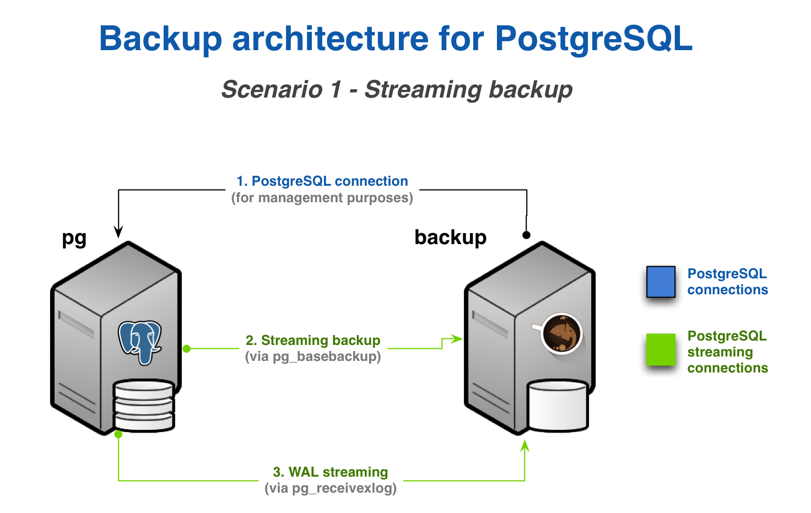
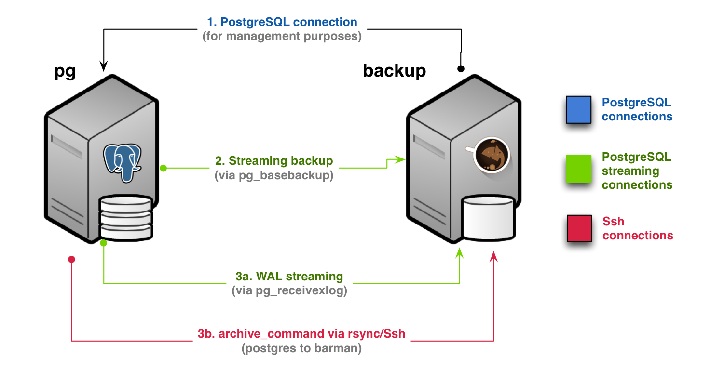
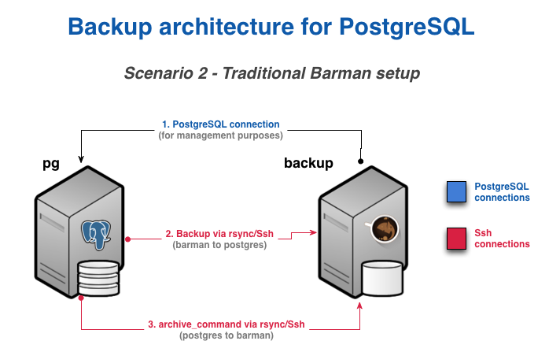
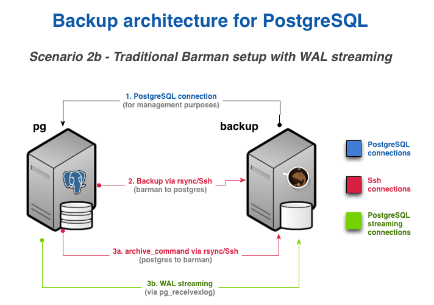

\newpage

# Design and architecture

## Where to install Barman

One of the foundations of Barman is the ability to operate remotely from the database server, via the network.

Theoretically, you could have your Barman server located in a data centre in another part of the world, thousands of miles away from your PostgreSQL server.
Realistically, you do not want your Barman server to be too far from your PostgreSQL server, so that both backup and recovery times are kept under control.

Even though there is no _"one size fits all"_ way to setup Barman, there are a couple of recommendations that we suggest you abide by, in particular:

- Install Barman on a dedicated server
- Do not share the same storage with your PostgreSQL server
- Integrate Barman with your monitoring infrastructure [^nagios]
- Test everything before you deploy it to production

  [^nagios]: Integration with Nagios/Icinga is straightforward thanks to the `barman check --nagios` command, one of the most important features of Barman and a true lifesaver.

A reasonable way to start modelling your disaster recovery architecture is to:

- design a couple of possibile architectures in respect to PostgreSQL and Barman, such as:
    1. same data centre
    2. different data centre in the same metropolitan area
    3. different data centre
- elaborate the pros and the cons of each hypothesis
- evaluate the single points of failure (SPOF) of your system, with cost-benefit analysis
- make your decision and implement the initial solution

Having said this, a very common setup for Barman is to be installed in the same data centre where your PostgreSQL servers are. In this case, the single point of failure is the data centre. Fortunately, the impact of such a SPOF can be alleviated thanks to a feature called _hook scripts_. Indeed, backups of Barman can be exported on different media, such as _tape_ via `tar`, or locations, like an _S3 bucket_ in the Amazon cloud.

Remember that no decision is forever. You can start this way and adapt over time to the solution that suits you best. However, try and keep it simple to start with.

## One Barman, many PostgreSQL servers

Another relevant feature that was first introduced by Barman is support for multiple servers. Barman can store backup data coming from multiple PostgreSQL instances, even with different versions, in a centralised way. [^recver]

  [^recver]: The same [requirements for PostgreSQL's PITR][requirements_recovery] apply for recovery, as detailed in the section _"Requirements for recovery"_.

As a result, you can model complex disaster recovery architectures, forming a "star schema", where PostgreSQL servers rotate around a central Barman server.

Every architecture makes sense in its own way. Choose the one that resonates with you, and most importantly, the one you trust, based on real experimentation and testing.

From this point forward, for the sake of simplicity, this guide will assume a basic architecture:

- one PostgreSQL instance (with host name `pg`)
- one backup server with Barman (with host name `backup`)

## Streaming backup vs rsync/SSH

Traditionally, Barman has always operated remotely via SSH, taking advantage of `rsync` for physical backup operations. Version 2.0 introduces native support for PostgreSQL's streaming replication protocol for backup operations, via `pg_basebackup`. [^fmatrix]

  [^fmatrix]: Check in the "Feature matrix" which PostgreSQL versions support streaming replication backups with Barman.

Choosing one of these two methods is a decision you will need to make.

On a general basis, starting from Barman 2.0, backup over streaming replication is the recommended setup for PostgreSQL 9.4 or higher. Moreover, if you do not make use of tablespaces, backup over streaming can be used starting from PostgreSQL 9.2.

> **IMPORTANT:** \newline
> Because Barman transparently makes use of `pg_basebackup`, features such as incremental backup, parallel backup, deduplication, and network compression are currently not available. In this case, bandwidth limitation has some restrictions - compared to the traditional method via `rsync`.

Traditional backup via `rsync`/SSH is available for all versions of PostgreSQL starting from 8.3, and it is recommended in all cases where `pg_basebackup` limitations occur (for example, a very large database that can benefit from incremental backup and deduplication).

The reason why we recommend streaming backup is that, based on our experience, it is easier to setup than the traditional one. Also, streaming backup allows you to backup a PostgreSQL server on Windows[^windows], and makes life easier when working with Docker.

  [^windows]: Backup of a PostgreSQL server on Windows is possible, but it is still experimental because it is not yet part of our continuous integration system. See section _"How to setup a Windows based server"_ for details.

## Standard archiving, WAL streaming ... or both

PostgreSQL's Point-In-Time-Recovery requires that transactional logs, also known as _xlog_ or WAL files, are stored alongside of base backups.

Traditionally, Barman has supported standard WAL file shipping through PostgreSQL's `archive_command` (usually via `rsync`/SSH). With this method, WAL files are archived only when PostgreSQL _switches_ to a new WAL file. To keep it simple, this normally happens every 16MB worth of data changes.

Barman 1.6.0 introduces streaming of WAL files for PostgreSQL servers 9.2 or higher, as an additional method for transactional log archiving, through `pg_receivewal` (also known as `pg_receivexlog` before PostgreSQL 10). WAL streaming is able to reduce the risk of data loss, bringing RPO down to _near zero_ values.

Barman 2.0 introduces support for replication slots with PostgreSQL servers 9.4 or above, therefore allowing WAL streaming-only configurations. Moreover, you can now add Barman as a synchronous WAL receiver in your PostgreSQL 9.5 (or higher) cluster, and achieve **zero data loss** (RPO=0).

In some cases you have no choice and you are forced to use traditional archiving. In others, you can choose whether to use both or just WAL streaming.
Unless you have strong reasons not to do it, we recommend to use both channels, for maximum reliability and robustness.

## Two typical scenarios for backups

In order to make life easier for you, below we summarise the two most typical scenarios for a given PostgreSQL server in Barman.

Bear in mind that this is a decision that you must make for every single server that you decide to back up with Barman. This means that you can have heterogeneous setups within the same installation.

As mentioned before, we will only worry about the PostgreSQL server (`pg`) and the Barman server (`backup`). However, in real life, your architecture will most likely contain other technologies such as repmgr, pgBouncer, Nagios/Icinga, and so on.

### Scenario 1: Backup via streaming protocol

If you are using PostgreSQL 9.4 or higher, and your database falls under a general use case scenario, you will likely end up deciding on a streaming backup installation - see figure \ref{scenario1-design} below.

<!-- TODO: This way of referencing won't work in HTML -->
{ width=80% }

In this scenario, you will need to configure:

1. a standard connection to PostgreSQL, for management, coordination, and monitoring purposes
2. a streaming replication connection that will be used by both `pg_basebackup` (for base backup operations) and `pg_receivewal` (for WAL streaming)

This setup, in Barman's terminology, is known as **streaming-only** setup, as it does not require any SSH connection for backup and archiving operations. This is particularly suitable and extremely practical for Docker environments.

However, as mentioned before, you can configure standard archiving as well and implement a more robust architecture - see figure \ref{scenario1b-design} below.

{ width=80% }

This alternate approach requires:

- an additional SSH connection that allows the `postgres` user on the PostgreSQL server to connect as `barman` user on the Barman server
- the `archive_command` in PostgreSQL be configured to ship WAL files to Barman

This architecture is available also to PostgreSQL 9.2/9.3 users that do not use tablespaces.

### Scenario 2: Backup via `rsync`/SSH

The _traditional_ setup of `rsync` over SSH is the only available option for:

- PostgreSQL servers version 8.3, 8.4, 9.0 or 9.1
- PostgreSQL servers version 9.2 or 9.3 that are using tablespaces
- incremental backup, parallel backup and deduplication
- network compression during backups
- finer control of bandwidth usage, including on a tablespace basis

{ width=80% }

In this scenario, you will need to configure:

1. a standard connection to PostgreSQL for management, coordination, and monitoring purposes
2. an SSH connection for base backup operations to be used by `rsync` that allows the `barman` user on the Barman server to connect as `postgres` user on the PostgreSQL server
3. an SSH connection for WAL archiving to be used by the `archive_command` in PostgreSQL and that allows the `postgres` user on the PostgreSQL server to connect as `barman` user on the Barman server

Starting from PostgreSQL 9.2, you can add a streaming replication connection that is used for WAL streaming and significantly reduce RPO. This more robust implementation is depicted in figure \ref{scenario2b-design}.

{ width=80% }

<!-- TODO - Add a section on architecture for recovery? -->
