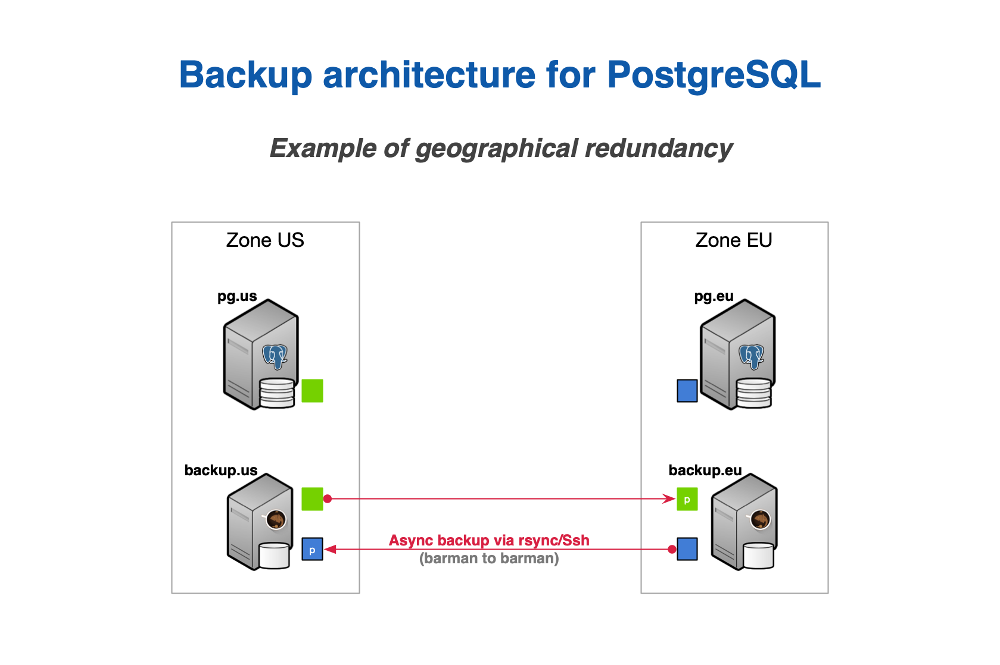
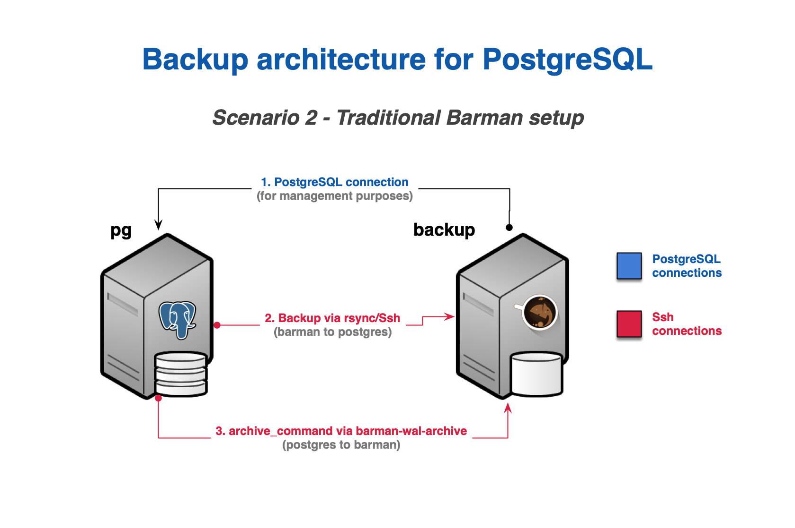
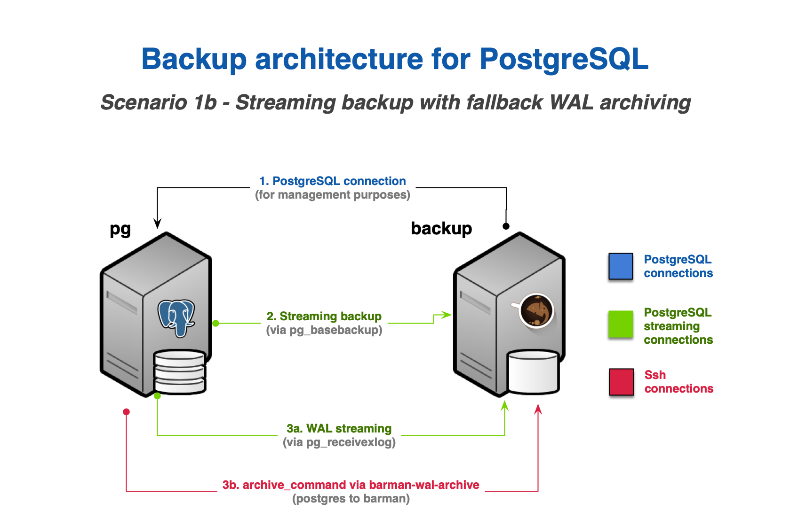
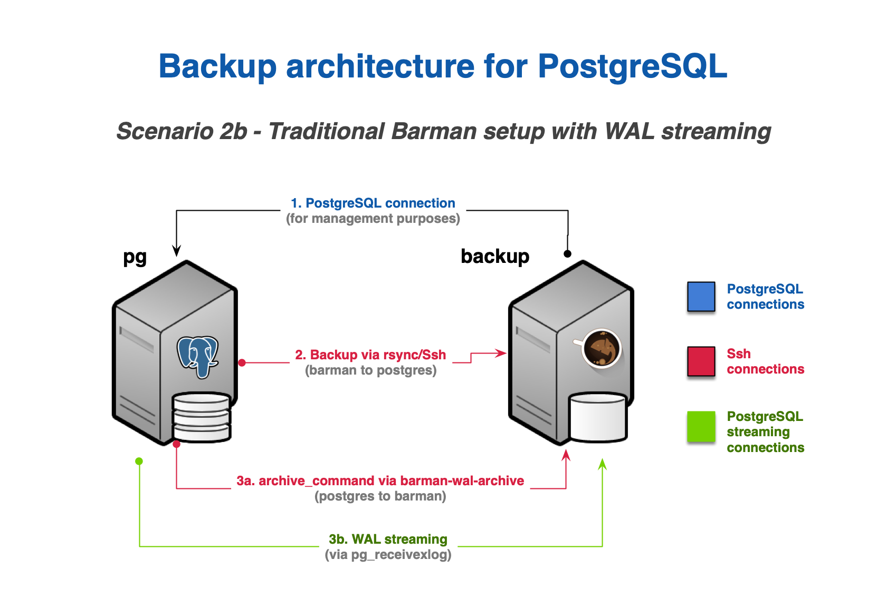

.. _architectures:

Architectural backup designs with barman
========================================

An effective disaster recovery plan begins with a carefully designed architecture.
Key decisions involve determining where to host your backup server and how to transfer
backups and WAL files, among other considerations. With that in mind, this section
explores a few different setups for deploying and managing backups with Barman.

.. _architectures-where-install-barman:

Where to install Barman
-----------------------

One of the foundations of Barman is the ability to operate remotely from the database
server, via the network.

Theoretically, you could have your Barman server located in a data center in another
part of the world, thousands of miles away from your Postgres server. Realistically,
you do not want your Barman server to be too far from your Postgres server, so that
both backup and recovery times are kept under control.

Even though there is no "one size fits all" way to set up Barman, there are a couple of
recommendations that we suggest you abide by, in particular:

* Install Barman on a dedicated server.
* Do not share the same storage with your Postgres server.
* Integrate Barman with your infrastructure monitoring tools.
* Test everything before deploying to production.

A good way to start modeling your disaster recovery architecture includes:

* Design a couple of possible architectures in regards to Postgres and Barman locations,
  such as:
  
  1. Same data center;
  2. Different data centers in the same metropolitan area;
  3. Different data centers;

* Elaborate the pros and the cons of each hypothesis.
* Evaluate the :term:`SPOF` of your system, with a cost-benefit analysis.
* Make your decision and implement an initial solution.

With that in mind, a very common setup for Barman is to be installed in the same data
center where your Postgres servers are, in which case the :term:`SPOF` is the data
center itself. Though the impact of such :term:`SPOF` can be significantly alleviated
with features such as :ref:`geographical redundancy <geographical-redundancy-TBD>`
(introduced in Barman 2.6) and
:ref:`Hook Scripts <concepts-barman-concepts-hook-scripts>`.

With geographical redundancy, you can rely on a Barman instance that is located in a
different data center/availability zone to synchronize the entire content of the source
Barman server. Also, given that geo-redundancy can be configured in Barman not only at
global level, but also at server level, you can create hybrid installations of Barman
where some servers are directly connected to the local Postgres servers, and others are
backing up subsets of different Barman installations (cross-site backup). Figure below
shows two availability zones (one in Europe and one in the US), each with a primary
Postgres server that is backed up in a local Barman installation, and relayed on the
other Barman server (defined as passive) for multi-tier backup via Rsync/SSH. Further
information on geo-redundancy is available in the
:ref:`geographical redundancy <geographical-redundancy-TBD>` section.

Thanks to :ref:`Hook Scripts <concepts-barman-concepts-hook-scripts>` instead, backups
of Barman can be exported on different media, such as tape via tar, or locations, like
an object storage bucket in a cloud provider.

Remember that no decision is forever. You can start this way and adapt over time to the
solution that suits you best. However, try and keep it simple to start with.

.. _architectures-one-barman-many-servers:

One Barman, many Postgres servers
---------------------------------

Another relevant feature first introduced by Barman is the support for multiple
servers. Barman can store backup data coming from multiple Postgres instances, even
with different versions, in a centralized way. As a result, you can model complex
disaster recovery architectures, forming a "star schema", where Postgres servers
rotate around a central Barman server.

Every architecture makes sense in its own way. Choose the one that resonates with you,
and most importantly, the one you trust, based on real experimentation and testing.

.. _architectures-backup-strategies:

Backup strategies
-----------------

The choice of a backup strategy will also play a vital role in your
setup. Barman is able to take backups using either Rsync, which uses SSH as a transport
mechanism, or ``pg_basebackup``, which uses Postgres streaming replication protocol.
Choosing one of these two methods is a decision you will need to make, however for
general usage we recommend using streaming replication for all currently supported
versions of Postgres.

.. note::
   Because Barman makes use of ``pg_basebackup`` when using streaming backups, features
   such as parallel backup are currently not available. In this case, bandwidth
   limitation has some restrictions - compared to the traditional method via Rsync.
   In Postgres versions prior to 17, incremental backups will also not be available
   when using this method.

Backup using Rsync/SSH is recommended in cases where ``pg_basebackup`` limitations pose
an issue for you.

The reason why we recommend streaming backup is that, based on our experience, it is
easier to set up. Also, streaming backup allows you to backup a Postgres server on
Windows, and makes life easier when working with Docker.

.. _architectures-wal-archiving-strategies:

WAL archiving strategies
------------------------

Recovering a Postgres backup relies on replaying transaction logs (also known as xlog
or WAL files). It is therefore essential that WAL files be stored by Barman alongside
the base backups so that they are available at recovery time. This can be achieved using
either WAL streaming or standard WAL archiving to copy WALs into the Barman server.

1. WAL streaming involves transferring WAL files from the Postgres server with
``pg_receivewal`` using the Postgres streaming replication protocol. With WAL streaming,
WALs are transferred while they are still being generated, which means that Barman
doesn't have to wait for WAL segments to be completely filled in order to receive them.
Such mechanism makes WAL streaming able to significantly reduce the risk of data loss,
bringing :term:`RPO` down to near zero values. It is also possible to add Barman as a
synchronous WAL receiver in your Postgres cluster and achieve zero data loss (RPO=0).
With the use of replication slots, we can also assure that no WAL file is recycled
before being successfully received by Barman.

Refer to the
:ref:`pre-requisites for wal streaming <pre-requisites-postgres-streaming-connection>`
for more information on how to install ``pg_receivewal``.

.. note::
    When using WAL streaming, it is recommended to always stream from the primary
    node. This is to ensure that all WALs are received by Barman, even in the event of
    a failover.

2. Barman also supports standard WAL file archiving, which is achieved using the
Postgres ``archive_command``, either using Rsync/SSH or ``barman-wal-archive``
from the ``barman-cli`` package. With this method, WAL files are archived only when
Postgres switches to a new WAL file, which normally happens every 16MB worth of data
changes. This approach offers more flexibility by allowing you to pick a tool of your
choice for transferring the WAL files.

It is required that either WAL streaming or WAL archiving be configured. It is
optionally possible to configure both WAL streaming and standard WAL archiving - in
such cases Barman will automatically de-duplicate incoming WALs. This provides a
fallback mechanism so that WALs are still copied to Barman's archive in the event that
WAL streaming fails.

For general usage we recommend configuring WAL streaming only.

.. note::
    Previous versions of Barman recommended that both WAL archiving and WAL streaming
    were used. This was because Postgres versions older than 9.4 did not support
    replication slots and therefore WAL streaming alone could not guarantee all WALs
    would be safely stored in Barman's WAL archive. Since all supported versions of
    Postgres now have replication slots, it is sufficient to configure only WAL
    streaming.

.. _architectures-scenarios-for-backups:

Two typical scenarios for backups
---------------------------------

In order to make life easier for you, in this section we summarize the two most typical
scenarios for a given Postgres server in Barman. Bear in mind that this is a decision
that you must make for every single server that you decide to back up with Barman.
This means that you can have heterogeneous setups within the same Barman server.

We will be using ``pg`` and ``backup`` to refer to a Postgres and Barman servers
respectively. However, in real life, your architecture will most likely contain other
technologies such as repmgr, pgBouncer, Nagios/Icinga, and so on.

.. _architectures-scenarios-for-backups-backup-via-streaming:

Scenario 1: Backup via streaming protocol
^^^^^^^^^^^^^^^^^^^^^^^^^^^^^^^^^^^^^^^^^

As stated in :ref:`Streaming Backups <concepts-barman-concepts-streaming-backups>`,
this approach uses the Postgres streaming protocol for transferring cluster files to your
Barman server. This is done with the use of the  ``pg_basebackup`` utility. In Barman,
this method can be set by having ``backup_method = postgres`` in your Barman server
configurations.

With this approach, you can leverage from :ref:`block-level incremental backups <concepts-barman-concepts-block-level-incremental-backups>`
support provided by ``pg_basebackup``, available in Postgres 17 or later. Block-level
incremental backups tend to be much more efficient than :ref:`file-level incremental backups <concepts-barman-concepts-file-level-incremental-backups>`
provided by Rsync strategies in terms of deduplication ratio.

This method is used in conjunction with WAL streaming for WAL files. In Barman's
terminology, this setup is known as streaming-only setup as it does not use any SSH
connection for backup and archiving operations. This is particularly suitable and
extremely practical for Docker environments and highly regulated environments,
for example.

The streaming backup method is usually the recommended approach for most use cases.

The figure below illustrates how this setup would function in practice.

.. image:: images/barman-architecture-scenario1.png
   :scale: 50%
   :align: center

In order to configure it, you need:

1. A standard connection to Postgres, for management, coordination, and monitoring
purposes.

2. A streaming replication connection to be used by both ``pg_basebackup``
(for base backup operations) and ``pg_receivewal`` (for WAL streaming).

.. _architectures-scenarios-for-backups-backup-via-rsync:

Scenario 2: Backup via rsync/SSH
^^^^^^^^^^^^^^^^^^^^^^^^^^^^^^^^

As stated in :ref:`rsync backups <concepts-barman-concepts-rsync-backups>` concepts,
this approach relies on Rsync to transfer backup files to your Barman server. This is
done by putting your server in backup mode and transferring your cluster files using
Rsync.

A key advantage in this approach is the possibility of using :ref:`parallel jobs <configuration-parallel-jobs>`
when running backup operations, which can significantly decrease the overall time to take
backups. It also provides the ability to take :ref:`file-level incremental backups <concepts-barman-concepts-file-level-incremental-backups>`,
which reuses files of a previous backup for deduplication. File-level incremental backups
can be more flexible than :ref:`block level incremental backups <concepts-barman-concepts-block-level-incremental-backups>`
as each backup is completely independent of the others, which means you can delete a
root backup without affecting its incremental backups in any way.

Another advantage of this method is that it allows for a finer control over bandwidth
usage, including on a per-tablespace basis. You can check
:ref:`Managing Bandwidth Usage <backup-managing-bandwidth-usage>` for further details.

The figure below illustrates how this setup would function in practice.

In order to configure it, you will need:

1. A standard connection to Postgres for management, coordination, and monitoring
purposes.

2. An SSH connection to be used by Rsync for base backup operations that allow the
**barman** user on the Barman server to connect as the **postgres** user on the
Postgres server.

3. An SSH connection for WAL archiving to be used by the ``archive_command`` in Postgres
that allows the **postgres** user on the Postgres server to connect as **barman** user
on the Barman server.

.. _architectures-scenarios-for-backups-hybrid-scenarios:

Hybrid scenarios
^^^^^^^^^^^^^^^^

It is also possible to use a hybrid approach, combining both backup and WAL
transferring methods in order to achieve optimal results for a specific use case.

1. When using the streaming-only setup, described in the 
:ref:`Scenario 1 <architectures-scenarios-for-backups-backup-via-streaming>`, you can
also configure WAL archiving via SSH in addition to WAL streaming. In such scenarios,
WAL archiving would act as a fallback mechanism in case WAL streaming failed. See the
image below.

2. When using the Rsync backup method, described in
:ref:`Scenario 2 <architectures-scenarios-for-backups-backup-via-rsync>`, you can also
configure WAL streaming instead of using the ``archive_command`` in order to have a
lower :term:`RPO`. You can also opt for configuring WAL streaming in addition to WAL
archiving and have both options. See the image below.

.. _architectures-cloud-snaphost-backups:

Cloud snapshot backups
----------------------

Barman also supports cloud snapshot backups, which takes a snapshot of the
storage volume where your Postgres server resides in the cloud. Barman currently
supports this method on Azure, Google, and AWS. The prerequisites for this method will
depend on which cloud provider where your Postgres server resides, so we recommend
checking the :ref:`backup-cloud-snapshot-backups` section for further details.